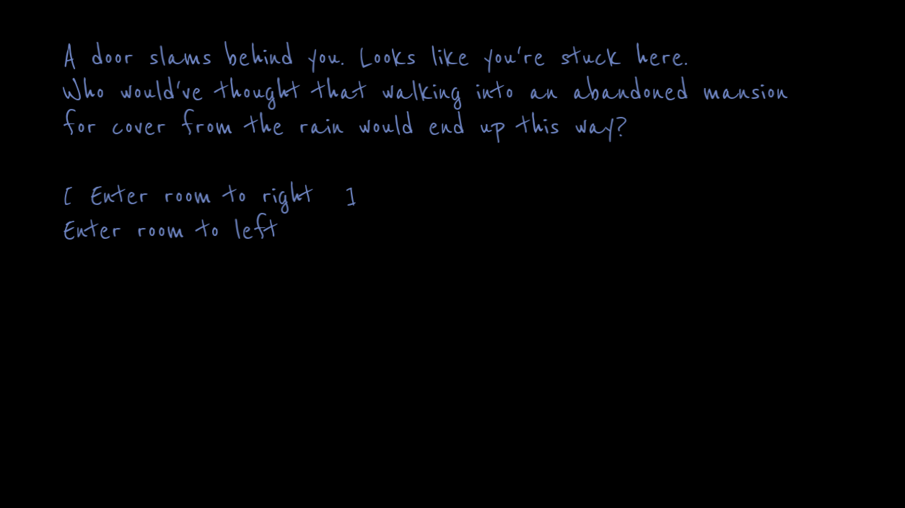

# Haunted House

Author: Sarah Pethani

Design: You explore a haunted house that a young girl lives in. Find a way to leave.

Text Drawing: We use harfbuzz to shape the text, and freetype to render text. At runtime, we pass some text to a function called render_text, which adds the text to the harfbuzz buffer and shapes it. For each character, if we had seen it previously, we use the texture we have stored. Otherwise, we use freetype to render the glyph, create a texture using OpenGL, and store it in our dictionary of characters/textures. We then display the texture. All text drawing logic occurs at runtime.

Choices: A text file contains the story/choices. Before each choice, type the number of the scene it should switch to after selecting the given choice.

Screen Shot:

How To Play:

Use the up/down arrow keys to select a choice. Press enter to select the choice.

Sources: Using font [ReenieBeanie](dist/ReenieBeanie-Regular.ttf) with [license](dist/README-ReenieBeanie.txt).

This game was built with [NEST](NEST.md).

